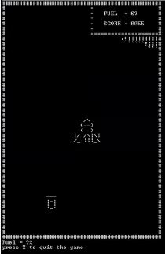
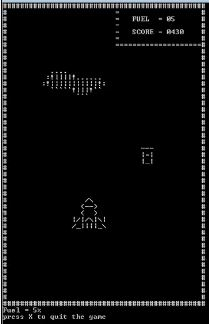
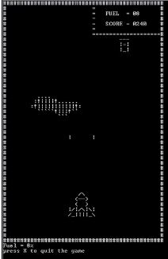

---

# Rocket Game in C++

## Overview

This game was created for fun by editing the classic Snake game C++ code available online. The original Snake game was a source of inspiration and a starting point for this project.

Blast off into space with this engaging rocket game written in C++. Navigate your rocket, dodge obstacles, and manage your fuel to achieve high scores. The game features real-time updates and a simple command interface for an exciting gameplay experience.

## Screenshots

Here’s what the game looks like:

## Features

- **Rocket Navigation**: Move the rocket in four directions using keyboard inputs.
- **Fuel Management**: Collect fuel to keep your rocket flying.
- **Obstacle Avoidance**: Dodge obstacles to avoid game over.
- **Scoring System**: Earn and display points based on your performance.

## Controls

- **W**: Move rocket up
- **A**: Move rocket left
- **S**: Move rocket down
- **D**: Move rocket right
- **E**: Fire missiles
- **X**: Quit the game

## Game Instructions

1. **Start the Game**: Compile and run the game executable.
2. **Control the Rocket**: Use the specified keys to navigate the rocket.
3. **Collect Fuel**: Navigate to fuel icons to increase your score.
4. **Avoid Obstacles**: Steer clear of obstacles to prevent game over.
5. **Track Score**: The score and fuel levels are displayed on the screen.
6. **End Game**: The game ends when fuel is depleted or an obstacle collision occurs.

## Dependencies

- The game uses `<conio.h>` for keyboard input handling and `<unistd.h>` for sleep functionality. These are typically available on Unix-like systems.

## License

This game is provided as-is. Feel free to modify and distribute it under your own terms.

---
